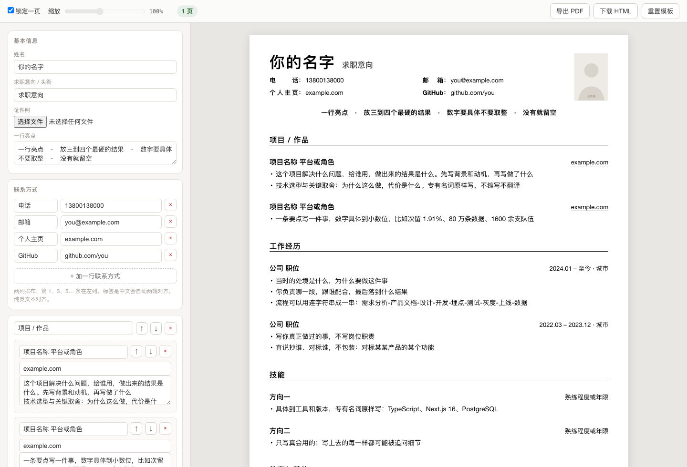

# resume-zh

**把任何一份中文简历排成干净、克制的一页。**

字号、三级间距、冒号对齐、链接右对齐这些都有定死的值，不用自己试。内容多了少了版面自己收放，永远是一页。改的时候在浏览器里点着改，改完直接写回文件，导出就是 PDF。

## 排版是怎么定的

- **一页是硬约束。** A4，上下 10mm、左右 11mm 边距，可用高度 1046.9px。
- **三级间距按 1 : 1.9 : 2.9。** 行间隙 5.9px、条目 11px、区块 17px。这个比例保证一眼能看出哪儿是一条经历的边界——条目间距掉到行间隙的 1.5 倍以下，整页就糊成一片。
- **内容增删之后自己填回一页。** 间距和字号由两个比例变量驱动，页面加载时二分求解，底部固定留 4px。加了内容先压间距，压到感知下限才动字号。
- **对齐是规则不是手工。** 联系方式的标签两端对齐撑满固定宽度，左边缘和冒号同时对齐；日期和所有正文链接一律顶到右缘。
- **中文该有的细节。** 中英文之间加空格、句末标点全篇统一、不用斜体、长网址允许断行。

配套还有两份东西：`references/voice.md` 是一套「去 AI 味」的中文文案规则，`references/workflow.md` 是人和 agent 同时改一份文件不互相覆盖的流程。

## 在线版：打开就能用

**<https://resume-zh-4qs.pages.dev>** —— 单个 HTML，不装东西不起服务，左边填内容右边出简历。

打不开这个地址就用本地的，功能完全一样：

```bash
# 方式一：仓库里已经有了，双击打开就行
open app/index.html            # macOS
start app\index.html           # Windows
xdg-open app/index.html        # Linux
```

或者不 clone 仓库，直接存一个文件：

```bash
curl -O https://raw.githubusercontent.com/OwenZhao9/resume-zh-skill/main/app/index.html
open index.html
```

**这个文件是完全离线的**——CSS、脚本、占位头像全内嵌，不连任何外部资源，断网也能用。自动保存靠浏览器 localStorage，个别浏览器对本地文件禁写存储，那种情况下改完点「下载 HTML」留档就行。



**左边填内容，右边实时出简历。**

左栏是一个表单：基本信息、联系方式、以及任意多个区块。每个区块下面挂任意多条经历，每条经历有标题、右侧（时间地点或一个网址）、和一个「一行一条要点」的文本框。区块和经历都能加、能删、能上下移。改任何一个字，右边那张 A4 立刻重排。

顶部工具条：

- **锁定一页**（默认开）。加内容时版面自动收，永远一页；压到最小字号还塞不下会提示你删减。
- **缩放滑块**。取消锁定后可用。这时候比例冻结在当前值，继续加内容就会顶到第二页、第三页；你可以拖滑块整体压回一页，也可以自己删几句。
- **页数**。实时显示当前几页，超页变红；纸面上每 297mm 一条红线，能看出断在哪。
- **导出 PDF / 下载 HTML / 重置模板**。

几个不用管的细节：联系方式的标签是中文会自动两端对齐、纯英文不对齐；要点里行尾写个网址会自动变成右对齐的可点链接；电话和邮箱自动加 `tel:` / `mailto:`。

「下载 HTML」存下来的文件把你的数据一起带走了——下次直接双击那个文件，内容还在，还能接着改。

## 安装

```bash
git clone https://github.com/OwenZhao9/resume-zh-skill ~/.claude/skills/resume-zh
```

Claude Code 会自动发现 `~/.claude/skills/` 下的 skill。之后直接说「改简历」「简历排版」「简历有 AI 味」就会触发。

只用脚本、不用 agent 也可以，见下面。

## 怎么用

### 1. 生成可编辑版

```bash
python3 scripts/make_editable.py 简历.html
# 输出 简历-可编辑.html
```

它做三件事：给可编辑元素加 `contenteditable`、把外链 CSS 内联进去、注入存盘脚本。

### 2. 起本地服务

```bash
python3 scripts/server.py          # 默认 127.0.0.1:8899
```

浏览器打开 `http://127.0.0.1:8899/简历-可编辑.html`，点任何一段文字直接改，停手 0.8 秒自动存回文件。每次写入前会在 `_backups/` 留一份带时间戳的备份。

### 3. 自检格式

```bash
python3 scripts/check.py 简历-可编辑.html
```

扫：中英文之间缺空格、句末标点不统一、残留斜体、链接不可点、数字写法、时间线断档。

### 4. 导出 PDF

```bash
"/Applications/Google Chrome.app/Contents/MacOS/Google Chrome" --headless \
  --no-pdf-header-footer --print-to-pdf=简历.pdf \
  "http://127.0.0.1:8899/简历-可编辑.html"

pdfinfo 简历.pdf | grep Pages   # 必须是 1
```

走 `http://` 而不是 `file://`——自适应填页的脚本要跑，`file://` 下有些浏览器会拦。

## 内容

| 文件 | 说明 |
|---|---|
| `SKILL.md` | skill 入口，模板来源与快速上手 |
| `references/voice.md` | 文案规则：什么话不能写、为什么假、怎么改 |
| `references/format.md` | 排版规则：一页上限、三级间距、自适应填页、冒号对齐、链接右对齐、空格与标点、字体 |
| `references/workflow.md` | 协作流程与三个必踩的坑 **（动手前必读）** |
| `scripts/server.py` | 本地存盘服务：页面改动写回文件，带版本校验与自动备份 |
| `scripts/make_editable.py` | 从静态 HTML 生成可编辑版 |
| `scripts/check.py` | 格式自检 |
| `app/index.html` | 在线版单文件：左边表单填内容、右边实时预览，含缩放滑块与锁定一页 |
| `templates/style.css` | 简历样式 |
| `templates/*.cls *.sty` | LaTeX 版式，来自 Auto-CV |

## 几条核心规则

完整版见 `references/`，这里列最容易被忽略的：

**三级间距的比例是 1 : 1.9 : 2.9**（行间隙 : 条目 : 大块）。条目间距掉到行间隙的 1.5 倍以下，整页就"融为一体"，看不出哪儿是一条经历的边界。

**空间不够时的让步顺序**：bullet 间距 → 条目间距 → 大块间距 → 行高 → 字号。字号最后动，因为它会引起重新折行，可能反而多出一行。

**不要在字体栈里写 `-apple-system`。** Chrome 导出 PDF 时 SF Pro 不可嵌入，会静默降级，PDF 和屏幕上长得不一样。

**中文简历不要有斜体。** LaTeX 模板里 `\textit{}` 的习惯不要带进来。

**照片不能靠负 margin 顶出页边距。** Chrome 打印会在页面区域边界硬切，实测能切掉 2.3mm。要放大只能向下占版面，或者用 `object-fit: cover` 把照片自带的白边裁掉。

**去 AI 味的重点不是换词，是删掉「元陈述」。** 「产品判断写在作品里：……」这种先给自己的做法贴个抽象标签、再举例证明标签的句子，正常人不会这么说话。删掉标签句，直接说事。

## 一条铁律

**用户在浏览器里改的东西是权威版本。**

改文件之前先读页面，改完之后不要替用户刷新，永远不要清 localStorage、不要重新生成整个可编辑文件。

违反这条会静默抹掉用户几十分钟的修改，而且大概率恢复不了。`references/workflow.md` 里记了三个真实踩过的坑，动手前先读。

## 模板来源

LaTeX 版式源自 [flamingoTOM/Auto-CV](https://github.com/flamingoTOM/Auto-CV)，继承其 `resume.cls` 的宏与骨架，**不继承其排版趣味**（原模板把状态词固定塞进 `\textit{}` 斜体槽）。

原仓库是 Windows/MiKTeX 专用，macOS 用 TeX Live 的 `tlmgr`，或 TinyTeX（装用户目录，不需要 sudo）。

## 许可

模板部分遵循 Auto-CV 上游许可；规则文档与脚本部分 MIT。
